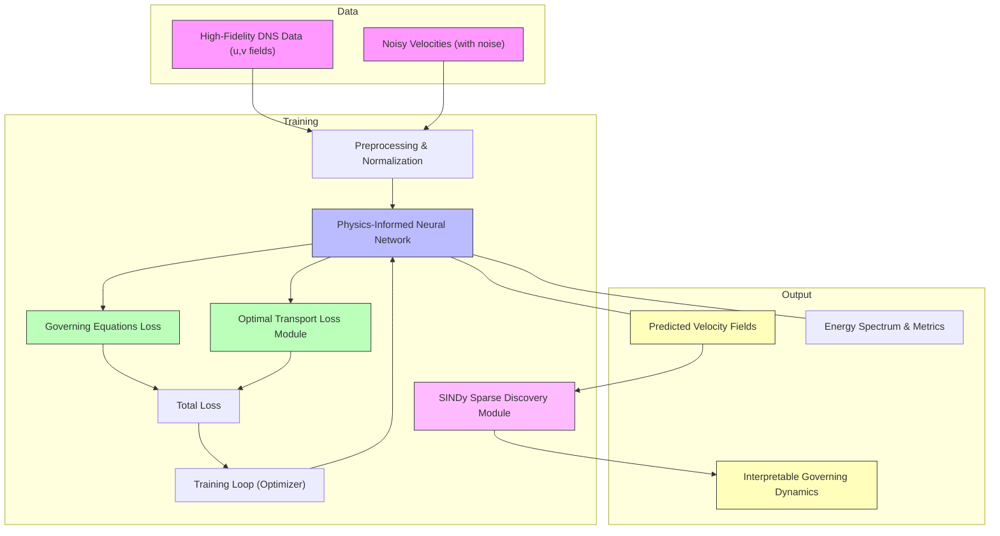

# MSML Conference  
## Optimal Transport PINNs: A Data-Efficient Approach to High-Fidelity Turbulence Modeling

---

## Overview

This repository presents a hybrid modeling framework that combines *Optimal Transport–enhanced Physics-Informed Neural Networks (OT-PINNs)* with *Sparse Identification of Nonlinear Dynamical Systems (SINDy)* to learn reduced-order turbulence models from noisy *Direct Numerical Simulation (DNS)* data.

The approach targets high–Reynolds-number turbulent flows and demonstrates how **interpretable, physics-consistent dynamics** can be extracted from partial and corrupted data using modern deep learning techniques.

This project is intended for research and educational use.

---
### High-Level Architecture
The framework learns turbulent velocity fields $u(x,t)$ by minimizing a composite loss L = L_PINN + $λ$ L_OT, where physics residuals enforce the Navier–Stokes equations and Optimal Transport aligns predicted and DNS data distributions under noise. The learned latent dynamics are post-processed using SINDy to identify a sparse governing system ż = $Θ(z)$ $ξ$, resulting in an interpretable reduced-order turbulence model.



---
## Features

- Time-dependent PINNs for learning velocity fields across multiple timesteps  
- Optimal Transport–based loss to mitigate training instability and spectral bias  
- SINDy integration for sparse, symbolic discovery of governing dynamics  
- CUDA-enabled training for accelerated performance  
- Robust learning from velocity fields with up to 5% noise corruption  
- Energy spectrum comparison against DNS for physical validation  
- Modular and extensible design for other PDE systems  

---

### Requirements

- Python 3.8 or higher  
- CUDA-compatible GPU (recommended for performance)

## Results

### Performance Benchmarks

| Metric                | OT-PINN (Ours) |
|-----------------------|---------------|
| Mean u-error          | ~2.1e-2       |
| Mean v-error          | ~2.4e-2       |
| Energy spectrum match | Yes           |
| Model stability       | Robust        |

### Key Observations

- Accurate reconstruction of turbulent velocity fields  
- High-fidelity agreement with DNS energy spectra  
- Sparse and interpretable governing dynamics identified via SINDy  

All visualizations are generated within the training scripts.

## Future Directions

- Extension to full three-dimensional turbulence simulations  
- Integration with attention-based neural PDE solvers  
- Online and streaming PINN training  
- Differentiable coupling with Navier–Stokes solvers (e.g., JAX-CFD)  

---

## License

This project is intended for academic and research use.  
Please cite the associated work when using or extending this repository.

## Publications and Citation

If you use this work in your research, please cite:

```bibtex
@article{MSML2025,
  title  = {Optimal Transport PINNs with SINDy for Turbulence Modeling},
  author = {Mahapatra, Anjan and Raj, Nikhil},
  year   = {2025},
}

